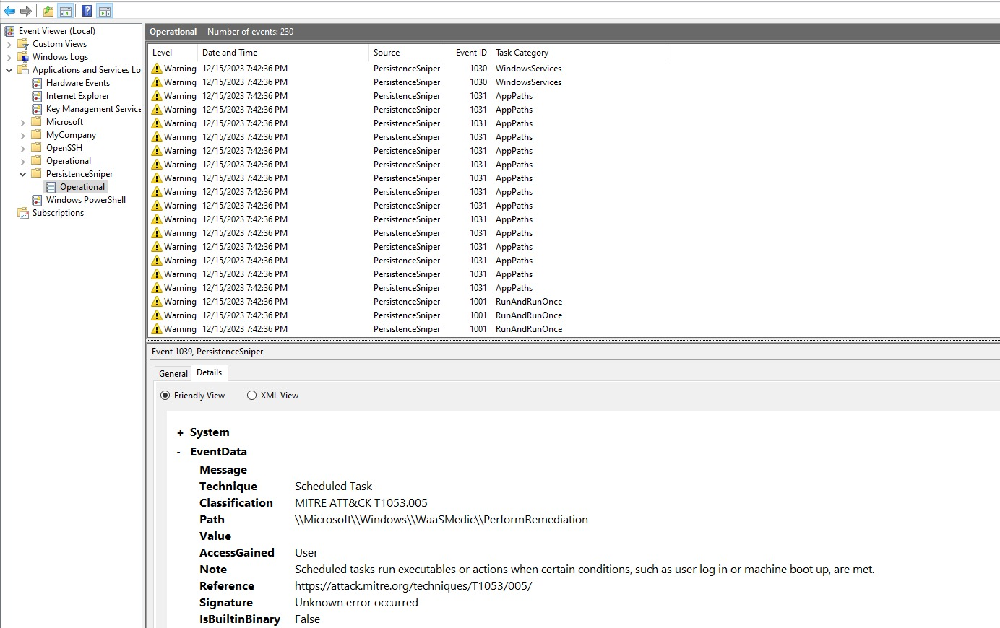

# Write-ToETW

## Description

Write-ToETW is a PowerShell plugin that allows PersistenceSniper to ship results to the Event Trace for Windows (ETW). 

It uses a custom EventSource to show the results in a standardized and formatted way using the Windows Event Viewer.

## Installation

> Suppose that the PersistenceSniper folder is located at `C:\PersistenceSniper\`, otherwise make the following changes:
> - Open the `PersistenceSniper.man` file and change the **resourceFileName** and **messageFileName** path variable
> - Open the `Write-ToETW.psm1` file and change the **Add-Type** instruction with the `ETWLib.dll` path

- Install the Windows SDK: run the **WinSDKInstaller.ps1** to install the Windows SDK. The Windows SDK will be used to compile the PersistenceSniper ETW Manifest.
- Compile the ETWLib.cs file with `C:\Windows\Microsoft.NET\Framework64\v4.0.30319\csc.exe /target:library ETWLib.cs` command;
- Install the PersistenceSniper ETW Manifest: run the following commands:
  - Compile the manifest using the `mc -css Namespace PersistenceSniper.man` command
  - Run the Resource Compiler with the `rc PersistenceSniper.rc` command
  - Compile the library using the CSC command: `C:\Windows\Microsoft.NET\Framework64\v4.0.30319\csc.exe /target:library /unsafe /win32res:PersistenceSniper.res PersistenceSniper.cs`
  - Install the custom provider with the `wevtutil im PersistenceSniper.man`
- Modify the PersistenceSniper custom EventSource assembly path: open the **Write-ToETW.psm1** file and change the path on this line: `Add-Type -Path "C:\PersistenceSniper\Modules\ETWLib.dll"`.
- Import the Write-ToETW.psm1 with the following command: `Import-Module .\Write-ToETW.ps1`
- Use the module to forward the results. For instance: `Find-AllPersistence -PersistenceMethod All | Write-ToETW`
