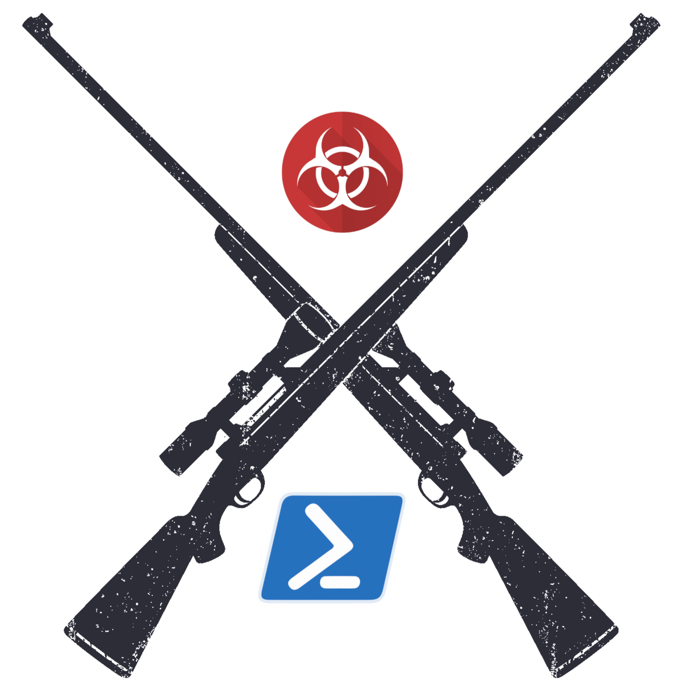
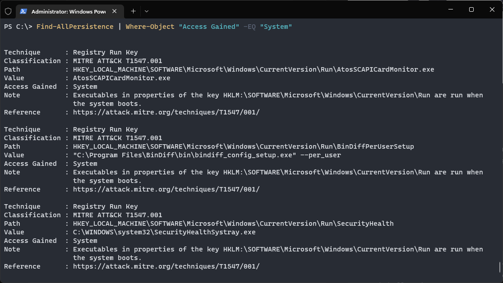
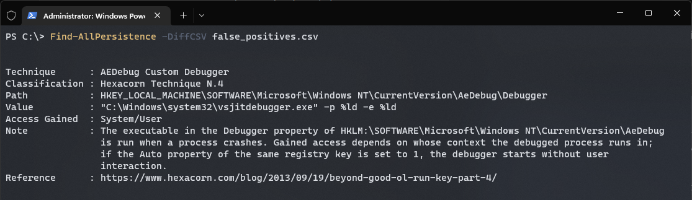

# Persistence Sniper
Persistence Sniper is a Powershell script that can be used by Blue Teams, Incident Responders and System Administrators to hunt persistences implanted in Windows machines.

## Usage
Using Persistence Sniper is as simple as:
```
PS C:\> git clone https://github.com/last-byte/PersistenceSniper
PS C:\> Import-Module .\PersistenceSniper\PersistenceSniper.ps1
PS C:\> Find-AllPersistence
```

Persistence Sniper's `Find-AllPersistence` returns an array of objects of type PSCustomObject with the following properties:
```
$PersistenceObject = [PSCustomObject]@{
      "ComputerName" = $ComputerName
      "Technique" = $Technique
      "Classification" = $Classification
      "Path" = $Path
      "Value" = $Value
      "Access Gained" = $AccessGained
      "Note" = $Note
      "Reference" = $Reference
} 
```

This allows for easy output formatting and filtering. Let's say you only want to see the persistences that will allow the attacker to regain access as an administrator (aka System):

```
PS C:\> Find-AllPersistence | Where-Object "Access Gained" -EQ "System"
```



## Interpreting results
As already introduced, `Find-AllPersistence` outputs an array of Powershell Custom Objects. Each object has the following properties, which can be used to filter, sort and better understand the different techniques the function looks for:
- ComputerName: this is fairly straightforward. If you run `Find-AllPersistence` without a `-ComputerName` parameter, PersistenceSniper will run only on the local machine. Otherwise it will run on the remote computer(s) you specify;
- Technique: this is the name of the technique itself, as it's commonly known in the community;
- Classification: this property can be used to quickly identify techniques based on their MITRE ATT&CK technique and subtechnique number. For those techniques which don't have a MITRE ATT&CK classification, other classifications are used, the most common being [Hexacorn's one](https://www.hexacorn.com/blog/2017/01/28/beyond-good-ol-run-key-all-parts/) since a lot of techniques were discovered by him. When a technique's source cannot be reliably identified, the "Uncatalogued Technique N.#" classification is used; 
- Path: this is the path, on the filesystem or in the registry, at which the technique has been implanted;
- Value: this is the value of the registry property the techniques uses, or the name of the executable/library used, in case it's a technique which relies on planting something on the filesystem;
- Access Gained: this is the kind of access the technique grants the attacker. If it's a Run key under HKCU for example, the access gained will be at a user level, while if it's under HKLM it will be at system level;
- Note: this is a quick explanation of the technique, so that its workings can be easily grasped;
- Reference: this is a link to a more in-depth explanation of the technique, should the analyst need to study it more.

## Dealing with false positives
Let's face it, hunting for persistence techniques also comes with having to deal with a lot of false positives. This happens because, while some techniques are almost never legimately used, many indeed are by legit software which needs to autorun on system boot or user login.

This poses a challenge, which in many environments can be tackled by creating a CSV file containing known false positives. If your organization deploys systems using something like a golden image, you can run Persistence Sniper on a system you just created, get a CSV of the results and use it to filter out results on other machines. This approach comes with the following benefits:
- Not having to manage a whitelist of persistences which can be tedious and error-prone;
- Tailoring the false positives to the organizations, and their organizational units, which use the tool;
- Making it harder for attackers who want to blend in false positives by not publicly disclosing them in the tool's code.

`Find-AllPersistence` comes with parameters allowing direct output of the findings to a CSV file, while also being able to take a CSV file as input and diffing the results.

```
PS C:\> Find-AllPersistence -DiffCSV false_positives.csv
```



## Persistence techniques implemented so far
There are literally hundreds of already public persistence techniques, with more coming out by the week. This is a list of the ones implemented so far:
- [x] [Run Key](https://attack.mitre.org/techniques/T1547/001/)
- [x] [RunOnce Key](https://attack.mitre.org/techniques/T1547/001/)
- [x] [Image File Execution Options](https://attack.mitre.org/techniques/T1546/012/)
- [x] [Natural Language Development Platform 6 DLL Override Path](https://www.hexacorn.com/blog/2018/12/30/beyond-good-ol-run-key-part-98/)
- [x] [AEDebug Keys](https://www.hexacorn.com/blog/2013/09/19/beyond-good-ol-run-key-part-4/)
- [x] [Windows Error Reporting Debugger](https://www.hexacorn.com/blog/2019/09/20/beyond-good-ol-run-key-part-116/)
- [x] [Windows Error Reporting ReflectDebugger](https://www.hexacorn.com/blog/2018/08/31/beyond-good-ol-run-key-part-85/)
- [x] [Command Prompt AutoRun](https://persistence-info.github.io/Data/cmdautorun.html)
- [x] [Explorer Load](https://persistence-info.github.io/Data/windowsload.html)
- [x] [Winlogon Userinit](https://attack.mitre.org/techniques/T1547/004/)
- [x] [Winlogon Shell](https://attack.mitre.org/techniques/T1547/004/)
- [x] [Windows Terminal startOnUserLogin](https://twitter.com/nas_bench/status/1550836225652686848)
- [x] [AppCertDlls DLL Injection](https://attack.mitre.org/techniques/T1546/009/)
- [x] [App Paths Hijacking](https://www.hexacorn.com/blog/2013/01/19/beyond-good-ol-run-key-part-3/)
- [x] [ServiceDll Hijacking](https://www.hexacorn.com/blog/2013/09/19/beyond-good-ol-run-key-part-4/)
- [x] [Group Policy Extensions DLLs](https://persistence-info.github.io/Data/gpoextension.html)
- [x] [Winlogon MPNotify](https://persistence-info.github.io/Data/mpnotify.html)
- [x] [CHM Helper DLL](https://www.hexacorn.com/blog/2018/04/22/beyond-good-ol-run-key-part-76/)
- [x] [Hijacking of hhctrl.ocx](https://www.hexacorn.com/blog/2018/04/23/beyond-good-ol-run-key-part-77/)  
- [x] [Startup Folder](https://attack.mitre.org/techniques/T1547/001/)  
- [x] [User Init Mpr Logon Script](https://attack.mitre.org/techniques/T1037/001/)  
- [x] [AutodialDLL Winsock Injection](https://www.hexacorn.com/blog/2015/01/13/beyond-good-ol-run-key-part-24/)  
- [x] [LSA Extensions DLL](https://persistence-info.github.io/Data/lsaaextension.html)

## Credits
The techniques implemented in this script have already been published by skilled researchers around the globe, so it's right to give credit where credit's due. This project wouldn't be around if it weren't for:
- [Hexacorn](https://www.hexacorn.com/) and his never-ending [Beyond good ol' Run key series](https://www.hexacorn.com/blog/2017/01/28/beyond-good-ol-run-key-all-parts/);
- [Grzegorz Tworek](https://twitter.com/0gtweet/) and his amazing [https://persistence-info.github.io/](https://persistence-info.github.io/);
- All the other researchers who disclosed cool and unknown persistence techniques.

I'd also like to give credits to my fellow mates at [@APTortellini](https://aptw.tf/about/), in particular [Riccardo Ancarani](https://twitter.com/dottor_morte), for the flood of ideas that helped it grow from a puny text-oriented script to a full-fledged Powershell tool.

## License
This project is under the [CC0 1.0 Universal](https://creativecommons.org/publicdomain/zero/1.0/) license.
